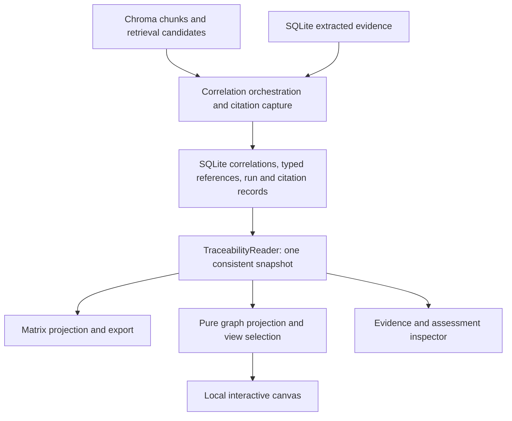

# Graph visualization revamp implementation plan

Planning baseline: 17 September 2026. This is a design and implementation specification, not an implemented feature. The audit used the working tree, which already contains substantial uncommitted changes. Implement against those files rather than assuming the last commit represents the current application. Only this document is changed by the planning task.

## 1. Observations about the current system

### 1.1 Audit scope and governing contracts

Read [AGENTS.md](../AGENTS.md), the canonical [architecture guide](architecture.md), [testing guidance](testing.md), [refactor plan](refactor-plan.md), [README](../README.md), and relevant historical graph/pipeline design material. Followed the actual ingestion/provenance, extraction, retrieval, correlation, persistence, matrix, graph, and UI paths listed below. Source and tests take precedence over historical proposals and stale comments.

This was a source-level audit. No application services, production databases, Ollama inference, destructive Neo4j tests, or runtime UI were started. Findings about executable behavior below follow from code; performance and usability targets later in this document are acceptance criteria, not measured results. Existing local `data/` and `evidence/` were not treated as fixtures. Tests were inspected, not executed during this document-only task.

Retain the existing contracts: immutable evidence/correlation history; unchanged chunk IDs and existing provenance; deterministic rules before Stage 2; the seven correlation statuses; current scoring formula and thresholds; existing prompt templates; calling-thread SQLite writes and progress callbacks; widgets and session state owned by `ui/pages/`. The visualization must perform no inference. This plan changes the downstream representation and its persistence, not parsing/chunking boundaries or the extraction ontology.

### 1.2 Actual data flow

| Step | Current components | Actual behavior |
|---|---|---|
| Source preparation | `pecs/ingestion/ingestor.py`, `parsing/`, `chunking/`, `normalization/` | Parse source structure, select chunks, normalize text, assign deterministic chunk IDs. Ingestion logs live in SQLite. |
| Search storage | `ui/pages/ingest_page.py`, `vectorstore/chroma_store.py` | UI embeds normalized chunks and upserts text, vectors, and scalar metadata to ChromaDB. |
| Extraction | `ui/pages/extract_page.py`, `extraction/extractor.py`, `validator.py`, `prompts.py` | Reads all Chroma chunks, invokes Stage 1, validates three entity types, inserts evidence on the calling thread. The UI's claim that only unextracted chunks are processed is inaccurate. |
| Candidate retrieval | `ui/pages/correlate_page.py`, `retrieval/pipeline.py`, `merger.py` | Retrieves up to 10 chunks per requirement; maps candidates by the descriptive requirement `entity_id`. Combines vector, available BM25, and literal-ID matches. No production caller builds the BM25 index. |
| Decisions | `traceability/matrix.py`, `correlation/rules.py`, `stage2.py`, `confidence.py` | Rules run first, optional Stage 2 handles ambiguous cases, confidence is recomputed, immutable correlations are inserted. |
| Matrix | `MatrixBuilder._build_matrix_from_correlations`, `load_latest`, `ui/pages/matrix_page.py` | Selects one highest-confidence correlation per requirement, constructs counts/sources, caches a matrix in session state, renders/export rows. |
| Graph | `graph/graph_sync.py`, `graph_builder.py`, `graph_queries.py` | Independently reads evidence and latest correlations from SQLite; rebuilds a Neo4j projection. It does not consume `MatrixRow` or the session matrix. |
| Canvas | `ui/pages/graph_page.py`, `ui/components/graph_network.py`, `graph_details.py` | Queries Neo4j, builds Pyvis HTML, embeds it in an iframe. Dropdowns drive the external inspector; canvas selections are not returned to Streamlit. |

The matrix is therefore an upstream *traceability product*, but its present flattened rows are not a sufficient graph interchange format. Matrix and graph currently implement different projections of the same incomplete records.

### 1.3 Available information and its reliability

| Object | Available fields | Important limitations |
|---|---|---|
| `EvidenceChunk` (`models/evidence_chunk.py`) | `chunk_id`, filename, source hash/type, index, locator, normalized text, metadata | ID is SHA-256 of source hash and chunk index. Locator identifies the chunk, not necessarily an exact entity span. Same content uploaded with another name is deduplicated. |
| Python chunks | `element_type`, `element_name`, `line_start`, `line_end`, `file_path` | Existing structural metadata can supply readable symbol labels. Large definitions may span multiple chunks with the same element metadata; line ranges can describe the enclosing definition. Do not claim an exact statement location. |
| Git chunks | Commit SHA, author, date, merge flag, changed-file count; formatted message and filenames in text | These are log-export chunks, not a call graph or necessarily code diffs. Changed-file names do not establish implementation or evaluation relationships. |
| Document/message chunks | Source-specific locators and available heading, page, subject, author, date metadata | Availability varies by parser and source. Missing fields must remain unknown. |
| `ExtractionResult` (`models/extraction_result.py`) | Three types: requirement, implementation, evaluation; descriptive `entity_id`, text, one nullable `linked_requirement`, filename/chunk, author/date, flexible metadata | Entity IDs are model-generated descriptive strings, explicitly not database keys. No canonical requirement key, human title, exact quote span, stable symbol reference, or structured evaluation verdict is required. Implementation includes delivery claims, not just code. |
| SQLite `evidence` | Adds integer `id` and insertion time; stores metadata as JSON | Deduplication checks `(entity_id, chunk_id, entity_type)`. Same ID across chunks and types is allowed. Different IDs for repeated extraction of one fact remain separate rows. |
| `RetrievedEvidence` | Full chunk plus vector/BM25/combined score, ID-match flag, retrieval methods | Relevance scores identify candidates; they are not per-edge proof or calibrated probabilities. These scores and candidate roles are not persisted in correlations. |
| `CorrelationResult` (`models/correlation_result.py`) | UUID, requirement string ID, overloaded evidence string ID, one of seven statuses, method/rule, confidence, supporting chunk IDs, reasoning/time | One record can describe a multi-evidence assessment but has only one nominal target. No run ID, typed endpoints, selected/rejected candidate roles, evidence-level judgment, or requirement row FK. |
| SQLite `correlation` | Integer insertion ID, unique correlation UUID, JSON chunk list | Repository insertion omits the model timestamp; SQLite supplies second-resolution time. Latest queries can return several tied records. |

Provenance exists earlier than the graph, but is not faithfully propagated. Chroma metadata uses `meta_` prefixes for scalar extras. `chunk_codec.reconstruct_evidence_chunk` retains those prefixed keys for retrieval, while the extraction page requests `include_extra_metadata=False`. The extractor does not subsequently copy structural provenance into SQLite evidence. The graph discards evidence metadata, guesses source type from filenames, and has no source hash or locator. Extraction validation uses `setdefault` for source filename/chunk, so model-supplied values can currently survive instead of the known input provenance.

### 1.4 How correlations are produced

The six actual passes in `RuleEngine.apply_rules` are:

1. Exact `linked_requirement == requirement.entity_id`: uses **all** matching implementation and evaluation chunks, but sets `evidence_entity_id` to the **first** implementation. Evaluation keyword/numeric-score heuristics choose the aggregate status; negative markers take precedence.
2. Strong semantic retrieval: top combined score at least **0.75** is sufficient, without a literal ID or code-type requirement. All candidates above the threshold plus linked evaluation chunks enter the supporting list; the primary target is the top **chunk ID**.
3. No evidence: no explicit implementation and retrieval below **0.30** produces `REQUIREMENT_NOT_IMPLEMENTED` with `"(none)"` as target.
4. Intermediate retrieval: up to five candidates at/above the floor go to Stage 2.
5. Unlinked evaluations: keyword overlap can produce a candidate requirement for Stage 2; otherwise an orphan correlation uses `"(unlinked)"` as requirement ID.
6. Conversational implementation claims can produce additional Stage 2 decisions, even for a requirement already resolved in an earlier pass.

Stage 2 returns an aggregate status and prose reasoning for the supplied bundle. It does not identify which candidate supports, contradicts, or is irrelevant to that status. It stores every supplied chunk as supporting and chooses the first retrieval candidate as nominal target (or the pre-extracted entity when there are no candidates). The requirement is truncated to 600 characters and evidence blocks to 800. `linked_evaluations` passed by rule 4 are not consumed by `classify`/`_build_evidence_blocks`.

Confidence combines retrieval score, resolution method, evidence count, source-document diversity, and a status multiplier. Candidate counts can contribute even when they have not been individually judged relevant. `score_batch` reconstructs `CorrelationResult`, so any new fields must explicitly survive scoring.

`MatrixBuilder` selects the highest-confidence decision, preserving the first on a tie. A requirement with no decision is displayed as not implemented with “No correlation computed.” Fresh counts use `max(supporting chunks, retrieved candidates)` and include sources from the top three candidates. Reloading supplies no candidates; counts and sources can change. Multiple entities in a chunk are collapsed in a dictionary. The persistent latest query groups by string requirement ID and maximum timestamp, not by an atomic run.

### 1.5 Current graph semantics and interactions

`GraphBuilder` creates Requirement, Implementation, Evaluation and SourceDocument nodes. Entity nodes merge by descriptive ID within their Neo4j label; source documents merge by filename. Canvas IDs for all entity types share the same unqualified string namespace.

Edges are `CORRELATES_TO` (requirement → nominal evidence), `EXPLICITLY_LINKS` (implementation → requirement), `EVALUATES` (evaluation → requirement), and `EXTRACTED_FROM` (entity → document). A 64-character lowercase hex target is guessed to be a chunk. A single `chunk_to_entity` dictionary chooses the last encountered entity for that chunk; chunks with no extracted entity are skipped. Supporting chunk IDs are decoded into the write payload but never assigned to the Neo4j edge. No-evidence decisions have no edge and their status is not copied to requirement nodes.

Focus and full graph both use a force-directed physics layout. Node labels are raw IDs, with details heavily truncated in hover text. Edge color/width encode aggregate status/confidence. Source nodes are hidden by default; toggles exist for evaluations and orphans. There are no status/source/method filters, requirement comparison, stable hierarchy, evidence-first navigation, edge inspector, or complete offline interaction contract.

### 1.6 Existing tests

`tests/unit/test_graph_builder.py` checks Cypher payloads with mocked sessions; `test_graph_queries.py` checks return types, parameters and query fragments; `test_graph_sync.py` characterizes three transactions; `test_graph_network.py` characterizes existing canvas structure. Some explicitly preserve bugs: document → requirement focus edges and the no-op orphan toggle. Query mocks supply a `requirement` key that the real query does not return.

`test_matrix_builder.py` checks the confidence winner/tie behavior. Repository, rules, confidence, validator, chunk, and Chroma codec tests cover useful lower-level contracts, but do not establish end-to-end traceability identity/citation correctness or actual browser selection. `tests/integration/test_graph_sync.py` requires explicit disposable Neo4j opt-in and checks graph materialization, not the full query-to-renderer contract. `tests/evaluation/labelled_data/golden_triples.json` is a sample seed, not a verified visualization ground truth or executable evaluation suite.

## 2. Problems found

### 2.1 Correctness defects that presentation cannot repair

| Problem | Evidence in current code | Consequence |
|---|---|---|
| Query/renderer contract mismatch | `_REQUIREMENT_EGO_NETWORK` returns `r`; `build_ego_network` and details read `requirement` | Focus requirement and its edges can disappear. Mock tests conceal this. |
| False focus provenance | `build_ego_network` connects every returned document to the focused requirement, reversing the stored direction and ignoring the actual owner | A code/evaluation source appears to be the source of the requirement. |
| Explicit implementations omitted | Query returns `explicit_impls`; renderer never traverses it | Valid extracted links disappear unless also chosen as the nominal correlation target. |
| Entity collisions and overwrite | Neo4j merges by descriptive ID; canvas IDs are untyped; some endpoint MATCH clauses have no label | Distinct evidence can collapse or connect to unintended nodes. |
| Missing or arbitrary evidence | Single chunk-to-entity lookup, one primary target, skipped raw chunks | Many-to-many traceability is reduced to a misleading single connection. |
| Lost negative/no-evidence state | Status exists only on correlation edges; sentinel targets are skipped | An unimplemented requirement can look like an unassessed isolated requirement. |
| Orphans defined by physical degree | Query checks `NOT (n)--()` although evidence normally has provenance edges; checkbox ignored | Unlinked evidence is neither found nor hidden consistently. |
| Types inferred from names | `_node_label` guesses type from a handful of ID prefixes; source type guessed from filename | Labels/styles are unreliable even when upstream typed information exists. |
| Evaluation filtering inconsistent | Focus adds correlated nodes before applying the evaluation toggle | Some evaluations remain visible when the toggle is off. |
| Incoherent latest state | Timestamp ties, independent projections, session matrix cache | Graph, fresh matrix and reloaded matrix can disagree. Multiple orphan evaluations also share the sentinel grouping key. |
| Sync is not atomic | Clear commits before constraint creation and rebuild | Failed rebuild can destroy the old derived view. Counts report attempted payload rows rather than matched/written entities. |

### 2.2 Semantic limitations to expose rather than disguise

- A semantic match is not proof of implementation. Retrieval does not exclude the requirement's own source chunk; a requirement or discussion can receive a high score and an implemented status under rule 2.
- An extracted explicit reference is an attributed relationship, not independent verification. The current prompts can produce a descriptive requirement ID such as `R3-gnn-training-pipeline` while a source mentions `R3`; exact joining can fail. Prefix matching would also be unsafe across documents or versions.
- Stage 2's bundle classification cannot support a separate “implements” or “validates” claim for every candidate. Prose reasoning must not be parsed into fabricated typed edges.
- An evaluation of a requirement does not establish which function it tested. There is no structured evaluation-to-code target. A linear requirement → code → evaluation chain would invent that relationship.
- Evaluation sentiment is a keyword heuristic, including substring/negation ambiguity. It is not a structured test result. Full original feedback and conflicting signs must remain inspectable.
- An implementation entity may be a chat claim. Calling every implementation node “code” would repeat the source problem.
- “No assessment,” “retrieval failed,” “no evaluation supplied,” and “assessed as not implemented” mean different things. Empty lists and red nodes currently conflate several of them.

### 2.3 Architectural conclusion

Neo4j currently supplies a small set of bounded adjacency/lookup queries that SQLite and an in-memory projection can serve. It adds a second interpretation, external availability requirement, stale state, destructive synchronization and extra test infrastructure without solving the identity or attribution problem. Retaining it is not justified for this feature. Pyvis's generated HTML embedding also lacks the application-level selection contract this explorer needs.

The target replaces both paths. The graph is a projection of structured traceability records; graph rendering is not a reason to create another source of truth. A future independent graph analytics/export feature could consume the same records, but is outside this implementation.

## 3. Proposed target design

### 3.1 Product contract

The default experience answers: “What is the recorded assessment of this requirement, what implementation/evaluation evidence is associated with it, why is each item associated, and where can I inspect the source?” It must also make shared evidence, gaps, ambiguity and unsupported claims visible.

Implement three views: **Requirement focus** (default), **Compare requirements** (up to five), and **Unlinked evidence**. A searchable requirement list with status/count summaries is the overview; do not replace it with an unrestricted whole-project hairball. The Matrix remains available and gains “View trace” navigation using the same stable key/run selection.

The canvas is a visual index into an inspector, not a substitute for complete evidence text. Every displayed relationship must have a stored basis or be explicitly marked as a provenance/grouping relation. Unknown details remain unknown. Visibility limits and filters never change recorded assessments.

### 3.2 Architecture and ownership



Concrete responsibilities:

| File/component | Responsibility |
|---|---|
| New `pecs/models/traceability.py` | Typed references, assessment context, run membership, citation DTOs and read snapshot models. No rendering or storage calls. |
| New `pecs/store/traceability_repo.py` | Atomic append of run/context/reference/snapshot records, typed reads and legacy adapter entry points. Accept an existing transaction; no nested commits. |
| New `pecs/store/migrations.py`; existing `database.py` | Versioned additive schema migration, indexes, dataset identity. |
| New `pecs/traceability/reader.py` | Resolve one selected run, build requirement summaries, preserve all assessments/participants, diagnose missing/ambiguous references. No Ollama, embedding, Chroma writes or graph-specific inference. |
| New `pecs/traceability/provenance.py` | Capture/validate chunk citations and normalize known `meta_` structural keys. Acquisition is explicit during correlation or historical hydration, never a hidden canvas operation. |
| Existing `traceability/matrix.py` | Keep `MatrixBuilder.build` as orchestration entry point initially; delegate saved reads/projection to the reader. Separate read-only projection so merely opening Matrix does not construct Stage 2. |
| New `pecs/graph/models.py`, `projection.py`, `views.py`, `labels.py` | Typed canvas nodes/edges, deterministic construction, filters/groups/limits/layout, shared display naming. No database drivers, Streamlit state or LLMs. |
| New `pecs/ui/components/trace_graph.py` and `trace_graph_frontend/` | Bidirectional canvas component with locally packaged assets; display DTO input, validated selection/action output. |
| Rewrite `ui/components/graph_details.py` | Pure presentation of selected DTO details, complete citations, assessments, diagnostics and related items. No whole-graph query on each selection. |
| Rewrite `ui/pages/graph_page.py` | Own run, filters, selection, navigation history and widget state; compose reader, projection, component and inspector. |
| Update `ui/pages/matrix_page.py`, `correlate_page.py`, `settings_page.py` | Shared snapshot identity, graph navigation, cache invalidation, expanded explicit reset operation. Remove graph auto-sync. |

### 3.3 Identity: separate record identity, source identity and display naming

Use existing immutable SQLite `evidence.id` as evidence-record identity. Add one persistent dataset UUID so links do not accidentally resolve after reset or against another database. Internal reference values are typed; canvas IDs are namespaced:

- `ev:<dataset_uuid>:<evidence.id>` for all extracted entities, with explicit node kind from `entity_type`.
- `chunk:<dataset_uuid>:<chunk_id>:<snapshot_id>` for a cited source chunk version. The original chunk ID remains unchanged.
- `source:<dataset_uuid>:<source_hash>` when a trusted source hash is available. Filename is a label, never the key. If hash is unknown, use an origin-specific fallback keyed by chunk ID; do not merge unrelated unknown sources by filename.
- `assessment:<dataset_uuid>:<correlation_id>` for inspector records and export references. Assessment records are not additional canvas nodes by default.
- View-only groups use a deterministic key containing view scope, kind, source key and ordered member keys; they are not persisted evidence.

Repeated extraction producing different IDs remains separate evidence, even if the text looks similar. Offer grouping by source/chunk with explicit record counts; do not silently consolidate semantic duplicates. Two requirement rows with the same ID are separate requirements until a separately designed canonicalization workflow exists. Stable row keys solve reference integrity within this dataset; they do not pretend to solve conceptual entity resolution across extraction runs.

### 3.4 Node content and deterministic labels

All nodes expose `id`, `kind`, `title`, `subtitle`, `full_text`, `source_ref`, `chunk_ref`, `quality_flags`, and available author/time/structural metadata. Requirements additionally expose selected assessment, all assessment IDs, workflow state, conflict flag and separate counts. There is no status property on a shared implementation node that depends on just one requirement.

| Node kind | Canvas content | Inspector content |
|---|---|---|
| Requirement | Short human-readable ID when safely available; first clause of requirement text; status badge or workflow-state badge | Complete requirement, original descriptive ID, record key, selected/all assessments, decision rationale, method/rule/confidence, counts, source locator, duplicate/ambiguity diagnostics |
| Implementation evidence | Python `element_name` + file/locator when available; otherwise text excerpt + source | Extracted assertion separately from source excerpt, source type, symbol metadata, author/date, linked requirement as extracted, associated requirements/assessments, hallucination flags. Conversational evidence is labeled “Implementation claim.” |
| Evaluation evidence | Excerpt of actual feedback + author/date or source locator | Complete feedback, original evaluation ID, provenance, explicit target reference, associated assessments; optional existing heuristic indicators labeled “heuristic,” including mixed/unknown. Never label it “passed test” without such a structured source. |
| Source chunk/context | Symbol or heading + source locator; badge “Rule-selected context,” “Classifier input” or “Legacy citation” as appropriate | Full saved normalized chunk, exact classifier-visible excerpt where applicable, original chunk ID/hash, retrieval scores/rank/method and usage. It is a chunk node even if it contains several extracted entity types. |
| Source document/version | Filename + type; short hash when names collide | Known source hash, recorded name, source type and entity/chunk counts. An uploaded basename is not a working filesystem link. |
| Missing citation | “Source unavailable” + short reference | Preserved original reference and reason. It is an explicit unresolved citation marker, not an invented implementation. |

Label algorithm in `graph/labels.py`:

1. Collapse display whitespace only; retain full source text separately. Use explicit type and trusted structural metadata, never ID-prefix type inference.
2. Requirement short-ID extraction is display-only: accept an anchored recognizable identifier token from the descriptive ID. Otherwise use `Requirement #<row id>`. This token must never become a join key.
3. Prefer Python symbol/known heading/commit short SHA for chunk subtitles. Do not invent fully qualified symbols, repository paths, requirement titles or summaries with an LLM.
4. Use at most two title lines (roughly 32 characters each, word-boundary ellipsis) and one source line. Inspector/accessible list retains complete text.
5. On collisions within the visible set add locator, then source hash, then record number. Selectbox option values are stable IDs; formatting functions provide labels. Never key options by rendered text.

### 3.5 Relationship semantics

The canonical read model preserves assessments and participant references separately. The default canvas renders direct evidence-to-requirement relationships with those references attached as edge metadata; it does not distribute aggregate status/confidence across fictitious pairwise verdicts.

| Edge kind / visible label | Endpoints | Required basis |
|---|---|---|
| `REFERENCES_REQUIREMENT` / “Explicit reference” | Implementation evidence → requirement | Unique resolution of stored `linked_requirement`, recorded as extraction attribution, not independent verification |
| `ASSESSES_REQUIREMENT` / “Evaluation reference” | Evaluation evidence → requirement | Unique explicit evaluation reference; preserve assessment membership separately |
| `ASSESSMENT_CONTEXT` / “Rule-selected context” | Chunk → requirement | Chunk explicitly selected by the deterministic rule; store the correlation UUID and rule name |
| `ASSESSMENT_CONTEXT` / “Classifier input” | Chunk or pre-extracted evidence → requirement | It was actually supplied to a Stage 2 call yielding this assessment; no claim that it individually supported the outcome |
| `ASSESSMENT_CONTEXT` / “Legacy citation” | Chunk or uniquely resolved evidence → requirement | Conservative interpretation of historical correlation fields, with attribution limitation |
| `RETRIEVED_CANDIDATE` / “Retrieved candidate” | Chunk → requirement | Retrieval result only; off by default, separate from assessed evidence |
| `EXTRACTED_FROM` | Entity → its actual source chunk | Exact stored chunk reference; in provenance expansion only |
| `PART_OF_SOURCE` | Chunk → its actual document/version | Trusted provenance; in provenance expansion only |

No implementation → evaluation edge, requirement hierarchy, call dependency, or “validates this function” relation is inferred. A shared item is one node linked to several requirements; this says it is associated with several requirements, not that all are satisfied. Requirements with no evidence still show their stored assessment/state and have no fake “none” node.

An edge carries: stable edge ID, source/target IDs, kind, basis, all contributing reference IDs, assessment IDs, optional retrieval metrics and warnings. Deduplicate by `(source, target, kind, basis)` within the selected run and aggregate backing references without loss. Different bases remain inspectable; show one visual connection with a basis-count badge when several overlap, with a list in its inspector. No edge thickness based on aggregate confidence. Status and confidence belong to the assessment/requirement summary; source/rank belongs to a reference; provenance and extracted text belong to a node.

### 3.6 Layout, grouping and density

Requirement focus uses a deterministic three-column arrangement: implementation evidence on the left, requirement in the center, evaluation evidence on the right. Neutral/context chunks occupy a distinct lower band so a high retrieval score does not make them look like code evidence. Arrowheads follow the semantic edge directions above regardless of left/right positioning. File groups are visual containers, not dependency edges.

Compare mode places up to five selected requirements in the center column and shares evidence nodes across them. Group evidence by kind then source identity. Sort by source label, locator/index, display title and stable ID. No force simulation by default; positions should remain stable under selection. Selection highlights only the chosen node/edge and its direct trace; unrelated edges are dimmed. Expand sources/chunks on demand from the selected item. Do not add all file nodes and provenance edges to every view.

Limits are deterministic UI constants in `graph/views.py`: default 40 evidence/context nodes and 80 relationship edges; hard expanded-view cap 150 nodes and 300 edges. Requirement anchors are never dropped. Paginate/aggregate per source group, not arbitrary global slicing. Expanded groups load the next 20 members. A high-degree shared item offers a searchable list of all associated requirements; selecting some enters Compare mode. Do not expand a hub to hundreds of nodes automatically.

Filtering order: selected snapshot → requirement scope → relationship-basis/type/source filters → optional candidate/provenance expansion → grouping and limits. Counts report total/filtered/visible/collapsed separately. A hidden source or evaluation does not become “missing evidence.” Status/confidence filters select requirements, not individual edges; evidence type/source/basis filters select associations. Keep the focused anchor with a notice if current filters hide all its relationships.

Unlinked means no resolved requirement association in the canonical selected dataset, ignoring provenance, grouping edges and UI filters. Distinguish “no extracted reference,” “reference ambiguous,” “reference target missing,” and “not used by an assessment.” Do not call an item orphaned merely because a filter hides its target. Requirements with missing evidence belong in the requirement list, not the unlinked-evaluation bucket.

An empty database shows ingestion/extraction guidance. Evidence without any correlation run remains browsable as unassessed evidence. With evaluations but no requirements, open Unlinked evidence directly; do not require a fake requirement or a successful matrix build to inspect it. Missing or malformed JSON/enum/reference records produce scoped diagnostics while valid neighboring records remain inspectable; never turn a database read failure into an “empty graph” success state.

### 3.7 Interaction and rendering contract

Replace Pyvis with a small local Cytoscape.js component using preset coordinates and explicit selection events. Cytoscape supports supplied node positions and node/edge interaction; this is a renderer choice, not a graph database requirement. Use its documented [preset layout and graph APIs](https://js.cytoscape.org/). Use the established Streamlit v1 bidirectional component API to fit the declared `streamlit>=1.30` baseline, rather than requiring an unrelated minimum-version jump. Python arguments and `Streamlit.setComponentValue` support the required round trip; returned values trigger reruns. See [Streamlit's component introduction](https://docs.streamlit.io/develop/concepts/custom-components/components-v1/intro).

Implement a plain TypeScript frontend bundled with Vite, `cytoscape` and `streamlit-component-lib`; commit a package lock and production build assets. Package assets with the Python wheel and document `npm ci && npm run build` for frontend development. Application users still launch with uv and need no Node runtime. No CDN, remote fonts, telemetry, remote content or raw source paths are needed to render the graph. Pin actual package versions during the frontend stage and record licenses; do not rely on whatever a remote script serves.

Python → component payload: `schema_version`, `snapshot_key`, `view_key`, display nodes/edges, positions, selection, expanded groups and theme. Send bounded excerpts, not all source text; the Python inspector reads full citations on demand.

Component → page event: `{event_id, snapshot_key, view_key, action, target_id}`. Supported actions: `select_node`, `select_edge`, `clear_selection`, `focus_requirement`, `expand_group`, `collapse_group`. Page validates IDs against the current authorized projection, rejects stale snapshot/view events, and ignores already handled event IDs. Hover and pan/zoom are frontend-local; avoid reruns for mouse movement. Use stable component keys and avoid rebuilding layout/viewport on a pure selection change. Reset viewport only on scope change or explicit “Fit”/“Reset layout.”

Required behavior:

- Single-click node/edge updates the adjacent inspector; same result is available through a keyboard-accessible entity/relationship list.
- Inspector includes “Focus this requirement,” “Compare associated requirements,” and “Show source context,” plus back navigation. No double-click-only functions.
- Search matches full text, original entity ID, filename and known symbol. Search results carry stable keys and can focus off-canvas items.
- Matrix “View trace” passes dataset, run and requirement row key. Navigating back preserves selection and filters. Invalid/reset links show an explicit stale-link message.
- Run selector offers latest completed run, previous completed runs and legacy history. Current evidence added after the run is shown separately as “Not in this run,” never silently inserted into a historical result.
- A persistent legend distinguishes node kind, status badge, explicit attribution, classifier input, candidate, provenance and unresolved references. Use shape/text/dash differences as well as color.
- Inspector presents full extracted text and source context separately, assessment reasoning, rule/method, confidence labeled “assessment score,” citations, and warnings. A mixed-assessment badge links to every contradictory decision.
- Source/code text is escaped/plain text (`st.code` for code, text-safe rendering otherwise). Do not interpolate evidence/IDs into `unsafe_allow_html`, JS or HTML. No file opener based on an uploaded filename.
- Provide a list/table fallback when JavaScript fails and JSON export of the filtered projection with snapshot/filter/limit metadata. PNG export of the displayed canvas is useful but secondary to correct evidence inspection.

### 3.8 Example acceptance trace

For a requirement with two explicitly linked code entities and positive and negative evaluation rows, the graph shows all four entities connected to the requirement. The requirement displays the existing rule's negative-evaluation aggregate status. Both feedback texts remain visible; the positive one is not painted as negative because of the aggregate outcome. The edge inspector identifies explicit references and the assessments that used them.

If another assessment used a raw retrieved Python chunk without an extracted entity, it appears as “Rule-selected context” or “Classifier input,” with symbol/file/locator when available. It is never silently attached to another entity in that chunk. A second requirement using the same saved chunk shares that node in Compare mode. A source-document expansion connects each actual entity to its own chunk/document, never all documents to the focused requirement.

## 4. Required upstream traceability changes

### 4.1 Scope and deliberate limits

Required changes are reliable identity, persistence of known participants/provenance, explicit run boundaries, and honest distinction between assessment state and evidence attribution. These materially enable a useful graph and fix matrix/graph disagreement. They do not require new extraction labels, LLM-generated titles, altered prompts, a new sentiment model, calibrated probabilities or a new scoring formula.

The current strong-semantic rule can still produce questionable implemented statuses. Preserve its result and prominently disclose its basis, including self-source context. This plan does not relabel that result behind the user's back. Likewise, Stage 2 per-candidate judgments remain unavailable. A later classifier-contract revision could return validated evidence references and roles, but that would change protected prompts and needs its own design/evaluation change. It is **not a dependency** of this revamp and must not be quietly bundled into it.

### 4.2 Typed correlation context, without rewriting old correlations

Keep `CorrelationResult`'s existing fields readable/writable for compatibility. Introduce a typed internal `AssessmentEnvelope` containing that result plus the following context. Pass envelopes through orchestration; call the unchanged scorer on their results and replace only the result within the envelope. This prevents `ConfidenceScorer.score_batch` from dropping new context while preserving the formula.

| Field | Contract |
|---|---|
| `requirement_row_id` | Integer FK to a requirement evidence record; nullable only for genuinely unlinked/legacy unresolved assessments |
| `scope` | `requirement_assessment`, `evaluation_review`, or `claim_review`; reflects the producing pass, not a new status |
| `sequence` | Deterministic ordinal in the run, independent of LLM completion timing |
| `references` | List of `AssessmentReference` values below; every item records why it was included |
| `producer_version` | Versioned context policy; preserve existing rule name, model name and prompt-version identifier in run settings |

`AssessmentReference` has an explicit discriminated target: `evidence` with `evidence_row_id`, `chunk` with `chunk_id`, or `unresolved` with original value, expected namespace and candidate keys. It also has `role`, optional `snapshot_id`, `rank`, nullable retrieval metrics, `visible_text` when passed to Stage 2, and a basis/version. Roles are:

- `explicit_implementation`, `explicit_evaluation`;
- `rule_selected_chunk`;
- `stage2_context` (pre-extracted and raw inputs distinguished by target kind);
- `retrieved_candidate`;
- `legacy_citation` / `legacy_primary_target`.

Roles are observations of pipeline use, not LLM verdicts. One target may have several roles; store them and deduplicate displayed nodes, not roles. Preserve the original `supporting_chunk_ids` in the legacy correlation unchanged. New counts use unique typed references rather than its duplicated list length.

### 4.3 Additive SQLite schema

Implement these tables through a numbered migration, using foreign keys, CHECK constraints for enumerations, and indexes on run/requirement/correlation/chunk lookups. JSON fields are validated at the repository boundary. Existing evidence/correlation rows are never updated or deleted by migration.

| Table | Required columns and constraints |
|---|---|
| `traceability_dataset` | Single UUID identity for the database. Explicit Settings reset replaces this record after deleting the dependent data. |
| `traceability_run` | `id INTEGER PRIMARY KEY`, unique `run_id TEXT`, dataset UUID, start/finish UTC times, `evidence_watermark INTEGER`, settings JSON, producer/schema versions, outcome `complete` or `complete_with_errors`. Insert only at final commit; insertion ID orders completed runs. |
| `traceability_run_requirement` | Composite PK `(run_id, requirement_row_id)`, required requirement FK, workflow state, nullable selected correlation UUID, diagnostics JSON. States: `assessed`, `stage2_disabled`, `classification_failed`, `retrieval_failed`, `ambiguous_reference`. Selection must refer to a correlation with this run/requirement context. |
| `traceability_run_candidate` | Composite PK `(run_id, requirement_row_id, chunk_id)`, rank, vector/BM25/combined scores, retrieval method and ID-match flag. Persist all returned candidates, including requirements with disabled/failed Stage 2 and no correlation. Reference the corresponding run-chunk entry; candidates do not require a correlation FK. |
| `correlation_context` | Correlation UUID PK/FK, run FK, nullable requirement evidence FK, scope, sequence; unique `(run_id, sequence)`. This sidecar supplies typed identity without changing the old correlation schema. |
| `correlation_reference` | Stable reference UUID PK, correlation FK, ordinal, target kind, nullable evidence FK/chunk ID, unresolved value/candidate JSON, role, optional snapshot FK, rank/scores/method/ID-match, classifier-visible text and basis version. CHECK requires exactly the fields for its target kind. |
| `chunk_snapshot` | `snapshot_id TEXT PRIMARY KEY` derived from canonical content/provenance, original `chunk_id`, source hash/name/type/locator/index, normalized text, structural metadata JSON, capture time and origin `pipeline` or `legacy_hydration`. Append-only; index chunk ID. |
| `traceability_run_chunk` | Composite PK `(run_id, chunk_id)`, nullable snapshot FK, availability `available`, `missing`, `conflict`, diagnostics JSON. Captures origins for all evidence within the run's watermark plus all referenced/retrieved chunks. |

Workflow state is not an eighth `CorrelationStatus`. An unassessed requirement has `status=null` in the new read DTO/JSON export. The seven persisted classification values remain unchanged. Update `MatrixRow`/consumers for optional status plus workflow state; replace the current automatic red “not implemented” fallback with “Not assessed”/specific failure text. Keep legacy output fields with documented meanings, add `schema_version=2`, stable requirement key, run ID, assessment IDs and typed counts. Existing JSON/CSV keys remain where meaningful, but null status and corrected counts are intentional documented behavior changes.

Run persistence is one transaction containing new snapshots, run, legacy correlation rows, context, references, candidates and requirement outcomes. Insert dependencies in FK order; insert requirement outcome rows after their selected correlations/context exist, then candidate rows. Extend repository insertion to accept the caller's transaction without committing internally. Stage 2 and retrieval happen before this transaction. Snapshot input evidence in a short SQLite read transaction, record its maximum row ID, then work from that list; exclude concurrently added evidence from this run. Rollback leaves the previous completed run usable. A crash before commit creates no half-run. Individual classification/retrieval errors can still commit a `complete_with_errors` run with explicit per-requirement states.

`TraceabilityReader` assembles extracted explicit-reference associations independently of whether a requirement has a completed assessment. Such edges carry their evidence-row basis and an empty assessment-ID list when unused. Retrieval-only context comes from `traceability_run_candidate`, so turning Stage 2 off does not make known candidates disappear. Correlation references describe actual assessment participation; the candidate table describes search output. These are separate counts and sources of edges.

### 4.4 Participant capture at the producing stage

Update `rules.py`, `stage2.py`, `matrix.py`, and `correlate_page.py` to carry row IDs alongside unchanged descriptive IDs:

- Retrieval maps and `resolved_req_ids` use requirement row IDs, not model strings. Exact extracted references first resolve to a unique requirement record; rule text/scoring still use existing values.
- Rule 1 records every matched implementation/evaluation **row**, not just their chunks and the first target.
- Rule 2 records each threshold-selected chunk and every evaluation actually used. Do not resolve a chunk to any entity it happens to contain. Other retrieved candidates are separately recorded as candidates.
- Rule 3 has no support target. Record successful empty/low retrieval separately from a retrieval failure.
- Stage 2 records the exact candidates/pre-extracted evidence supplied, their order, their source citations and the truncated text actually sent. Do not parse reasoning to infer selection. Preserve existing templates, truncation limits and retry behavior.
- The currently ignored `linked_evaluations` list remains an explicit limitation: record those unique extracted evaluation associations independently; do not mark them as classifier inputs unless actually passed. Changing the classifier's evidence bundle is deferred with the classifier-contract work, not silently added here.
- Orphan results have null typed requirement identity; never create a requirement node for `"(unlinked)"`/`"(unknown)"`. Claim/evaluation reviews retain their own scope even when they target an already assessed requirement.
- Persist all returned assessment envelopes and expose conflicting statuses. Select the highest-confidence assessment per requirement, preserving current winner policy; tie-break by stable producing sequence, then correlation UUID. All secondary decisions remain in the inspector. Do not compute a new worst-case or averaged status.

For incomplete attempts with an existing valid deterministic assessment, retain that assessment and attach the failed auxiliary-review diagnostic; do not erase it. For a requirement with no valid result, expose workflow state and null status. Source/candidate counts are computed from stored references and snapshots on both fresh and reloaded reads.

### 4.5 Reference resolution and ambiguous requirement identifiers

Resolve exact extracted `linked_requirement` strings against typed requirement rows. Resolve only if there is exactly one candidate; otherwise retain the reference as unresolved with all candidate row keys and a reason. Never choose the first row, fan out a single string into multiple asserted links, or join by filename/prefix similarity.

Do not implement a global alias registry or infer `R3` ↔ `R3-...` as an identity merge in this revamp. Preserve the raw link and offer candidate search in the inspector, clearly labeled as unresolved. A manual mapping editor or source-scoped canonical requirement registry is future work. This limitation is preferable to misleading certainty and does not require extraction prompt changes.

For new runs where an explicit link is ambiguous, it cannot feed the deterministic exact-match path as if resolved. Continue other eligible existing rules/Stage 2 per requirement row and retain the ambiguity diagnostic. This is an intentional reference-integrity correction; thresholds, rule precedence and confidence mathematics do not change. Add regression tests showing the specific status changes only in formerly ambiguous joins.

### 4.6 Durable provenance, with minimal extraction involvement

At correlation time, batch-read all evidence-origin chunk IDs and retrieved/referenced chunk IDs using `ChromaStore.get_by_ids`; reuse actual retrieved `EvidenceChunk` objects when they agree. Save available normalized text and metadata as immutable SQLite citation snapshots. This limited duplication is deliberate: a stored assessment must remain inspectable if Chroma is unavailable, reset or later changed. It is not a replacement search index and includes no embeddings. Capture source context even when Stage 1 extracted no entity.

Normalize known `meta_element_name`, `meta_element_type`, `meta_line_start`, `meta_line_end`, `meta_file_path`, `meta_heading_text`, `meta_commit_sha`, author/date fields into a typed provenance DTO while retaining original metadata. Do not change `chunk_codec`'s existing consumers' behavior incidentally; add an explicit provenance conversion function and tests. Prefer chunk's typed source information; unavailable source type is `UNKNOWN`, not a filename guess represented as fact. Multiple trusted payloads for the same chunk within a run become a conflict diagnostic, never last-write-wins.

Snapshot identity includes canonical text and provenance so later content under the same original chunk ID creates a distinct snapshot. This retains current chunk IDs while making historical context stable. Record source locators at their actual precision (chunk or enclosing element); do not manufacture exact quote spans or syntax-highlight normalized text as if byte-identical to the original file.

The only required change to Stage 1 validation is to enforce the supplied `source_document` and `chunk_id` rather than `setdefault` model values. This materially prevents incorrect citations; it does not change prompts, extracted semantic fields or worker behavior. Preserve existing evidence untouched and show mismatches detected during legacy hydration as diagnostics. Do not rerun extraction merely to get graph labels.

### 4.7 Retrieval failures and assessment availability

Add a structured retrieval outcome (`candidates`, per-method availability/errors) to the correlation orchestration path; retain `retrieve()` as a compatibility wrapper if other pages depend on its list return. `ChromaStore.count()` currently swallows failures, so the new outcome path needs a count/query operation that distinguishes a reachable empty collection from failure. Record BM25 as unavailable when not built, not as a failed search proving absence.

Use known explicit evidence even when retrieval fails, and retain the error in run diagnostics. If no deterministic result can be supported without the failed search, do not invoke the no-evidence rule with a fabricated empty successful search. Mark that requirement `retrieval_failed` with no new classification. This correction prevents service outages from becoming evidence of nonimplementation; it changes orchestration failure handling, not the classification or confidence rules. Activation/redesign of BM25 itself is out of scope.

### 4.8 Historical compatibility

Older correlations have no reliable run boundary. Do not group them into invented historical runs based on second-resolution timestamps. Expose a **Legacy latest** snapshot with a visible limitation banner and a historical assessment list ordered by `(created_at, id)`.

Legacy requirement ID resolution succeeds only for a unique requirement row. Multiple matches leave an unresolved assessment visible in diagnostics; never copy its status to all matching requirements. For each resolved requirement, take all records tied at its latest timestamp, apply highest-confidence selection with ascending integer correlation ID as the stable tie-break, and retain the alternatives. This approximates the old latest behavior deterministically, without claiming those rows came from one run. Show all orphan records in legacy unlinked history rather than applying the sentinel requirement grouping.

Resolve a historical target by actual membership in the evidence-ID index and chunk-ID registry, not by hex shape alone. Unique evidence match only → evidence reference; known chunk only → chunk reference; both or several matches → unresolved reference. Use supporting chunk IDs as `legacy_citation` references, not individually approved support. If source content is unavailable, keep a missing-citation marker with the original value; do not drop the relationship silently. Never convert a chunk to its “owning entity.”

Historical citation hydration is an explicit, idempotent acquisition operation using available Chroma records, storing `origin=legacy_hydration` and capture time. For legacy reads, use a uniquely available hydrated snapshot for the chunk; if multiple distinct snapshots exist, expose a version ambiguity and let the inspector list them instead of silently choosing the latest. Snapshot digests exclude capture time and serialize fields in a fixed order, so repeated capture of identical data is idempotent. Use the snapshot table's row-count/insertion watermark as the legacy hydration cache revision. Do not claim the recovered text is necessarily what an old classifier saw. Schema migration itself must work with Chroma offline and without network or inference. Opening the graph works with available SQLite data; it can offer “Recover available source context” when historical context is missing.

After the first new completed run, default both Matrix and Graph to that run, including explicit unavailable/unassessed states. Never fill a failed current requirement with an older successful assessment silently. Historical selection remains available. Newly extracted requirements after the run are shown in a separate “Not in this run” list; no-evidence requirements within the run remain visible.

## 5. Implementation stages and validation

### Stage 0 — Freeze contracts and build representative fixtures

Files: new synthetic fixtures under `tests/fixtures/traceability/`; characterization/acceptance tests under `tests/unit/` and later `tests/integration/`. Do not use local project evidence as fixtures.

Create scenarios for one requirement with multiple implementations and evaluations; raw unextracted context; multiple entity types in one chunk; reused IDs; conflicting same-run assessments; no-evidence versus unassessed; unresolved short requirement references; same filename/different source hashes; high-degree shared evidence; legacy timestamp ties; missing/malformed references; and adversarial display text. Include all seven statuses.

Record current rules/scorer output for unambiguous fixtures. Preserve these results through the revamp. Retain existing tests until replacements explicitly cover the behavior they characterized. Do not spend time repairing the old Cypher/Pyvis path that will be removed.

Exit: fixtures and model contract examples agree with sections 3–4, and every observed correctness defect has a named replacement acceptance case.

### Stage 1 — Add persistence and typed identities

Files: `models/traceability.py`, `store/migrations.py`, `store/traceability_repo.py`, `store/database.py`, transaction support in `store/correlation_repo.py`, focused repository/model tests.

Implement schema migration, dataset key, envelope/reference validation and atomic run insertion. Load existing schemas unchanged, preserve all evidence/correlation IDs and bytes, and never migrate from Neo4j. Add explicit row-key reads to `EvidenceRepo` without changing existing descriptive-ID lookup semantics. Back up via SQLite's backup API in the later deployment procedure; do not copy a live WAL database as a lone file.

Validate migration on empty and populated temporary databases, repeated startup, rollback on reference insert failure, FK/type constraints, reset/reopen identity, same-second runs and source snapshot conflicts. Validate that run writes commit all-or-nothing and older app tables still contain the existing columns/records.

Exit: a complete traceability run round-trips through SQLite with typed identities and no new inference.

### Stage 2 — Capture traceability context and source citations

Files: `correlation/rules.py`, `stage2.py`, `traceability/matrix.py`, `traceability/provenance.py`, `ui/pages/correlate_page.py`, `retrieval/pipeline.py`, targeted `vectorstore/chroma_store.py` API, `extraction/validator.py`.

Carry row IDs and immutable envelopes through the producing passes. Capture references, actual classifier inputs, candidate metrics and provenance; distinguish retrieval failures. Preserve all scoring/prompt/status contracts for unambiguous successful input. Add unique explicit-reference resolution and diagnostics. Store completed runs transactionally rather than inserting loose results and separately deriving views.

Test exact participant sets for every rule/pass, scorer round-trip preservation, duplicate chunks with multiple roles, Stage 2 failure/disabled behavior, successful empty retrieval versus outage, record-order independence, controlled explicit-ID ambiguity, source-field override, and no fabricated per-candidate judgment. Fake Ollama and Chroma; no external services.

Exit: all fields needed by the graph exist persistently; reloading does not require retrieval or classification. Existing rules/confidence tests still pass except deliberate identity/failure-state assertions documented in new tests.

### Stage 3 — One reader and matrix projection

Files: `traceability/reader.py`, `traceability/matrix.py`, `ui/pages/matrix_page.py`, shared status display definitions in a new `ui/components/traceability_styles.py`, compatibility/projection tests.

Implement new-run and legacy read paths, consistent selected-assessment policy, distinct counts, conflict/workflow badges and read-only matrix construction. Required counts are `implementation_entities`, `evaluation_entities`, `assessment_context_chunks`, `retrieved_candidate_chunks`, and `unresolved_references`; each counts unique typed targets in its category. Existing `evidence_count` becomes the unique union of actual assessment participant targets, excluding retrieval-only candidates; document that an entity and a chunk can be distinct targets. Sources derive from persisted participant provenance, not top-three transient candidates. Coverage uses the existing implemented-status set and total in-scope requirements; report assessed/unassessed totals alongside it.

Snapshot key is dataset UUID + run ID (or legacy evidence/correlation watermarks and hydration revision) + read schema version. Replace unqualified `last_matrix` reuse with snapshot-keyed cache entries. Refresh after correlation/extraction/reset; historical views keep their explicit run selection. The reader queries evidence at/below the run watermark, not the current all-evidence set.

Validate identical fresh/reloaded Matrix rows, counts, sources, selected correlation and graph-ready summary for the same snapshot. Test no service initialization on read, null-state exports, legacy ties/orphans, unresolved identities and evidence added after a run.

Exit: Matrix and graph will consume the same traceability semantics; no UI depends on “latest timestamp” joins directly.

### Stage 4 — Pure graph construction and view behavior

Files: `graph/models.py`, `projection.py`, `views.py`, `labels.py`; new unit tests replacing the old builder/network semantics.

Build canonical nodes/associations from the reader, then produce bounded views. Enforce unique typed IDs, closed edge endpoints, provenance ownership, deterministic ordering, label fallbacks, multiple relationship bases and shared-node identity. Implement limits, groups, filters, compare scope, candidate tray and unlinked predicates before adding frontend styling.

Tests assert exact node/edge/ref sets and metadata, not only counts. Include entity IDs resembling hashes, requirements/evaluations with identical display IDs, unnamed symbols, long Unicode text, repeated source names, mixed entity chunks, wrong/missing source provenance and hidden endpoints. Verify that filtering never changes summary status or turns context into support. Verify deterministic view payloads under input permutation and incremental group expansion.

Exit: JSON projections alone fully explain each relationship and satisfy bounded-view contracts.

### Stage 5 — Interactive UI and frontend

Files: `ui/components/trace_graph.py`, frontend source/build/lock, `graph_details.py`, `ui/pages/graph_page.py`, Matrix navigation, Python packaging metadata and frontend tests.

Implement the specified columns, local Cytoscape assets, selection protocol, edge/node inspectors, legends, filters, search, compare, historical selector and accessible list fallback. Add status/confidence styling at assessment level. Preserve viewport on selection reruns and test stale events. Include package assets in a built wheel and verify the installed component can find them outside the repository cwd.

Use frontend unit tests for payload/event handling and a browser test harness against a disposable Streamlit app with fixture SQLite data. Test offline rendering by blocking external network requests. Verify visible labels/tooltips, keyboard alternatives, edge selection, source expansion ownership, filter counts, back navigation and Matrix deep links. Evidence containing `<script>`, HTML attributes, Markdown delimiters, quotes and `</script>` must render as content without execution or broken layout.

Exit: a user can trace requirement → associated evidence → original context with clicks or the accessible list, and can inspect why every association exists.

### Stage 6 — Remove the superseded graph infrastructure

Files: remove `pecs/graph/graph_builder.py`, `graph_queries.py`, `graph_sync.py`, `neo4j_client.py` after call-site replacement; remove/rewrite `ui/components/graph_network.py`; update `graph/__init__.py`, `correlate_page.py`, `config.py`, `.env.example`, `pyproject.toml`, `uv.lock` and related tests/docs.

Remove Neo4j/Pyvis dependencies once `rg` confirms there are no remaining production consumers. No automatic Neo4j deletion or server/container shutdown: its derived data can be left unused. The new graph needs no “Rebuild Graph,” connection error screen, graph sync result or sync stats. Refresh means reread the selected SQLite snapshot, not reclassify or write another database.

Remove `NEO4J_*` settings and document that the new Graph works regardless of old `.env` values; existing settings already ignore unrelated extras, but add a config regression test for an old environment. Do not edit a user's `.env`. Graph disabling, if later required, is a UI feature flag rather than a storage dependency; no new flag is necessary for this release.

Replace obsolete Cypher/sync tests with the SQLite projection/integration suite after equivalent user contracts are covered. Remove the destructive Neo4j test fixtures/CLI flags only when no surviving tests use them; update `docs/testing.md`. This is removal of an unused backend, not deletion of failing tests to hide regressions.

Expand Settings' explicit reset to delete sidecar/reference/run/snapshot data before evidence/correlations, rotate dataset UUID, and clear graph/matrix selections and caches. Document the existing cross-store reset failure case; at minimum invalidate SQLite-derived views immediately after successful SQLite reset even if Chroma reset later fails. Reset never reconnects to Neo4j.

Update `README.md`, canonical `docs/architecture.md`, `docs/testing.md`, and AGENTS graph-service instructions in the implementation change. Mark `docs/design/graph-interpretability-layer.md` superseded with a link to the implemented design while retaining its historical record. This planning phase does not modify those documents.

Exit: normal app use, graph browsing and automated tests require SQLite/packaged assets, with Chroma/Ollama needed only for their existing pipeline duties and explicit historical hydration.

### Stage 7 — End-to-end acceptance and rollout

Run focused tests while developing, then the full suite required by AGENTS for a broad refactor:

```bash
uv lock --check
uv sync --locked
uv run --locked pytest tests/unit -q
uv run pytest
git diff --check
```

Run frontend unit/build/browser checks using committed scripts and document their commands in `docs/testing.md`. A release gate must exercise the built artifact, not only the frontend development server. Do not run old destructive Neo4j tests against the default endpoint during transition.

Acceptance checklist:

1. A stable label and source location identify every visible requirement, implementation and evaluation; raw hashes/descriptive IDs are secondary details except when all other information is absent.
2. Every declared association/citation in the selected snapshot is present in the canonical model or counted with an explicit unresolved/missing diagnostic. There is no silent drop or arbitrary target substitution.
3. Every canvas edge answers “why are these connected?” through its inspector; no evaluation-to-code relationship is invented.
4. Empty evidence, unassessed requirements, failed retrieval, disabled/failed Stage 2, orphan feedback and contradictory assessments look different and export distinctly.
5. Matrix and Graph agree on snapshot, selected status/confidence, unique participant counts and source identities after fresh computation, reload and navigation.
6. Dense fixtures remain bounded, with visible hidden/collapsed counts and recoverable members. Large shared artifacts never force an unbounded expansion.
7. No graph operation mutates evidence, correlations or assessment outcomes. Historical hydration writes only additive provenance snapshots with its actual capture time.
8. All views and source inspectors work with Neo4j absent and Ollama/Chroma offline after a complete run has been saved. Legacy missing citations degrade explicitly.
9. A synthetic 1,000-requirement/10,000-reference dataset loads the filtered index and a bounded focus view without sending the whole dataset to the browser. Initial local target: under 2 seconds for a cold focus view and under 300 ms for frontend selection/highlighting; measure hardware, payload and observed timings rather than claiming these in advance. Full inspector rerun target is under 1 second warm.
10. Manual usability checks can locate an implemented requirement's code, inspect negative feedback, distinguish a chat claim from code, identify shared evidence, and explain a missing implementation without reading the matrix. Capture failures and iterate layout/labels before release.

Deploy additive migrations first with a SQLite backup and a read-only dry-run report of legacy ambiguities/missing citations. No extraction/correlation rerun is mandatory to view historical data. Recommend a new correlation run to obtain complete typed participant and citation records. Once frontend/read parity passes, switch to the new Graph and remove the old backend in the same completed feature series; do not maintain two long-term interpretations.

Rollback before reset can restore the backed-up application/database or run old readers against the unchanged legacy tables; new sidecars do not rewrite old rows. Old UI semantics remain limited and will not understand new workflow states. Document this as application rollback compatibility, not assurance that the old graph becomes correct.

### Completion boundary

The revamp is complete when the new view communicates stored traceability faithfully, supports reliable inspection/navigation at realistic density, shares Matrix semantics and no longer depends on the old Neo4j/Pyvis projection. Automatic requirement deduplication, human adjudication/editing, revised prompts, evidence-level classifier verdicts, sentiment improvements, code call graphs, and corpus-wide retrieval quality tuning remain separate work. The UI must expose these remaining limits rather than imply that rendering has resolved them.
