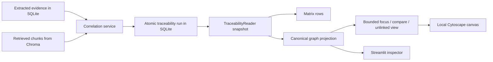

# The Evidence Graph: an implementation tutorial

This tutorial explains the graph visualization added to PECS, starting with the tools it uses and then following one requirement from correlation to the canvas and its inspector. For the broader application architecture, see [architecture.md](architecture.md); for the original design and acceptance criteria, see [graph-visualization-revamp-plan.md](graph-visualization-revamp-plan.md).

## Main libraries and tools

| Library or tool | Where it is used | Purpose in this feature |
| --- | --- | --- |
| **Streamlit** (`streamlit>=1.30`) | `pecs/ui/pages/`, `pecs/ui/components/trace_graph.py` | Run selection, filters, navigation, inspector, accessible list, and the bidirectional custom-component boundary. |
| **Cytoscape.js** (`cytoscape@3.30.4`) | `trace_graph_frontend/src/main.ts` | Draw and interact with the bounded graph using preset node positions. |
| **streamlit-component-lib** (`2.0.0`) | `trace_graph_frontend/src/main.ts` | Receive Python payloads and send click events back to Streamlit. |
| **Vite** (`6.3.5`) | `trace_graph_frontend/` | Build the local TypeScript frontend into static files shipped with the Python package. It is a build dependency, not a service the app needs at runtime. |
| **SQLite** (Python's `sqlite3`) | `pecs/store/` | Persist append-only correlation records, atomic run boundaries, typed references, retrieval candidates, and immutable source citations. |
| **ChromaDB** (`chromadb`) | `pecs/vectorstore/`, correlation-time retrieval | Supply searchable source chunks. The saved graph can be read without Chroma after a complete run is stored. |
| **Ollama** (`ollama`) | Existing extraction, embeddings, and optional Stage 2 classification | Produce upstream evidence and ambiguous-case assessments. Viewing a saved graph performs no Ollama call. |
| **Pydantic** | Existing evidence and correlation models | Validate upstream data and the existing seven correlation statuses. The graph projection itself uses small dataclasses. |
| **pytest** and **Streamlit AppTest** | `tests/unit/` | Verify persistence, matrix/graph parity, graph semantics, and page interactions without a graph server. |
| **uv** and **Hatchling** | `uv.lock`, `pyproject.toml` | Resolve the Python environment and package the built frontend into the wheel. |

The graph does **not** require Neo4j or Pyvis. Both were removed from the active graph path. The package versions above come from the repository's current manifests; Cytoscape.js and Vite are MIT-licensed, and streamlit-component-lib is Apache-2.0-licensed.

## What the graph is for

The Matrix answers, “What is the selected assessment for each requirement?” The Graph answers, “Which extracted evidence, classifier inputs, retrieval candidates, and source chunks explain what I am looking at?” It does not infer code dependencies, evaluation-to-code links, or a new verdict. Every displayed traceability connection comes from a stored extracted reference, a stored assessment reference, a retrieval candidate, or source provenance.

For example, suppose requirement `R12` is explicitly linked to two implementation entities and one negative evaluation. The center requirement node shows the selected aggregate status. The implementation and evaluation nodes retain their own text and source context. Edges state *why* each item is connected. Clicking the evaluation opens its feedback; clicking an edge opens the stored assessment and citation records behind that relationship. A candidate chunk has a separate, dashed connection and cannot be mistaken for confirmed support.

The processing path is:



## 1. Correlation now records the basis of its decisions

The existing deterministic rules still run before optional Stage 2 classification, and the existing confidence scorer still computes the assessment score. The change is that `pecs/traceability/service.py` also records *participants*: which evidence rows and chunks the decision actually used. `AssessmentReference` in `pecs/models/traceability.py` describes one participant with a role such as `explicit_implementation`, `explicit_evaluation`, `rule_selected_chunk`, or `stage2_context`. Its target is an evidence row, a source chunk, or an unresolved value.

An important excerpt is the explicit-reference capture:

```python
if corr.rule_name == "exact_requirement_id_match":
    refs.extend(
        AssessmentReference("explicit_implementation", "evidence", evidence_row_id=ev["id"])
        for ev in linked_impl
    )
    refs.extend(
        AssessmentReference("explicit_evaluation", "evidence", evidence_row_id=ev["id"])
        for ev in linked_eval
    )
```

The integer `evidence_row_id` is the durable identity. A descriptive `entity_id` may be duplicated or misleading, so it is retained for display and searching rather than used as a graph join key. The service similarly records Stage 2's visible evidence text and retrieval metrics for the inputs it passes to the classifier. Retrieved candidates are stored separately from actual assessment participants. This matters because “the search returned this chunk” is weaker than “the rule or classifier used this chunk.”

Retrieval now has a structured `RetrievalOutcome` containing candidates and an error. `retrieve_outcome()` checks Chroma with `count_strict()`, which can distinguish a reachable empty collection from a service failure. If retrieval fails and the deterministic evidence cannot support a decision, the requirement receives a `retrieval_failed` workflow state rather than a fabricated “no evidence” decision. No new graph-specific LLM prompt was introduced.

### Durable source citations

At correlation time, the service captures the source chunks cited by evidence or retrieval. `pecs/traceability/provenance.py` creates an immutable content-derived snapshot ID:

```python
body = {
    "chunk_id": chunk.chunk_id,
    "source_hash": chunk.source_hash,
    "source_document": chunk.source_document,
    "source_type": chunk.source_type.value,
    "source_locator": chunk.source_locator,
    "chunk_index": chunk.chunk_index,
    "normalized_text": chunk.normalized_text,
    "metadata": metadata,
}
canonical = json.dumps(body, sort_keys=True, ensure_ascii=False, default=str)
snapshot_id = hashlib.sha256(canonical.encode()).hexdigest()
```

The stored text, locator, source hash, and metadata let the inspector show what was saved with the run even when Chroma is later offline or changed. If a candidate chunk conflicts with the persisted version, the run marks that citation as a conflict instead of silently choosing one. Missing citations remain explicit missing records.

## 2. A traceability run is an atomic SQLite snapshot

`pecs/store/migrations.py` adds tables without rewriting the older `evidence` and `correlation` tables. The key new records are:

| Table | What it keeps |
| --- | --- |
| `traceability_dataset` | A dataset UUID, rotated by the explicit Settings reset. |
| `traceability_run` | Run ID, start/end time, evidence-row watermark, settings, and outcome. |
| `traceability_run_requirement` | Each requirement's workflow state and selected correlation. |
| `correlation_context` | The run and requirement row to which a correlation belongs. |
| `correlation_reference` | Typed participant targets, roles, citation IDs, and available retrieval details. |
| `traceability_run_candidate` | Retrieval results, separate from assessment references. |
| `chunk_snapshot` and `traceability_run_chunk` | Saved source text/provenance and each run's availability state. |

`TraceabilityRepo.save_run()` inserts the run, snapshots, correlations, references, requirement selections, and candidates inside one SQLite transaction:

```python
with self.conn:
    self.conn.execute("INSERT INTO traceability_run (...) VALUES (...)", values)
    # Insert chunk snapshots, correlation_context and correlation_reference rows,
    # then requirement selections and retrieval candidates.
```

The SQL above is shortened to show the transaction boundary; the complete parameterized statements are in `pecs/store/traceability_repo.py`. A failure rolls back the whole run rather than leaving the Graph and Matrix with different subsets. The evidence watermark ensures a historical run does not silently absorb evidence extracted later. Older evidence and correlation writes remain append-only.

## 3. Matrix and Graph read one interpretation

`TraceabilityReader.load()` in `pecs/traceability/reader.py` returns a snapshot containing the selected run's requirements, evidence, correlations, references, candidates, source chunks, explicit associations, and unlinked assessments. With no run ID it chooses the newest saved run; `"legacy"` invokes a conservative reader for older correlations.

The reader resolves an extracted `linked_requirement` only when its descriptive ID matches **exactly one** requirement row:

```python
targets = names.get(link, [])
associations.append({
    "evidence_row_id": row["id"],
    "requirement_row_id": targets[0] if len(targets) == 1 else None,
    "candidate_ids": targets if len(targets) != 1 else [],
})
```

Duplicate or missing targets stay unresolved. This avoids drawing a confident-looking line to an arbitrary requirement. The reader also computes distinct counts for implementation entities, evaluation entities, assessment-context chunks, candidate chunks, and unresolved references. Only actual assessment participants contribute to `evidence_count`; retrieval-only candidates do not.

`MatrixBuilder.build()` now runs `TraceabilityService`, receives the saved run ID, and loads that run through the reader. `_matrix_from_snapshot()` projects the same requirement summary used by the Graph into matrix rows. Its `requirement_key` is the typed graph key, so **View trace** on a Matrix row can select the same requirement and run in the Graph. An unassessed requirement has a null status and a separate workflow state rather than being mislabeled as not implemented.

### Historical records

The `legacy` view is deliberately cautious: older correlations lack reliable run boundaries and complete participant identities. It resolves a historical target only when unambiguous and marks missing context. The Graph offers **Recover available legacy source context**, an explicit, idempotent capture from Chroma; recovered text is identified as later hydration, not asserted to be the exact text an old classifier saw. Normal reading makes no writes.

## 4. The canonical graph represents typed records and relationships

`pecs/graph/projection.py` is a pure transformation from reader snapshot to dictionaries of `GraphNode` and `GraphEdge`. It does no database access, inference, or UI state management. The identity helpers separate durable identity from a short display label:

```python
def evidence_key(dataset: str, row_id: int) -> str:
    return f"ev:{dataset}:{row_id}"

def chunk_key(dataset: str, row: dict) -> str:
    return f"chunk:{dataset}:{row['chunk_id']}:{row.get('snapshot_id') or 'missing'}"
```

Requirement, implementation, and evaluation evidence use their SQLite row IDs within a dataset. Chunks include the original chunk ID and saved snapshot ID. Source-document nodes use a source hash when available. Thus an implementation and an evaluation can share a descriptive ID without merging, while the same saved evidence can appear once and connect to several requirements.

Node titles come from `pecs/graph/labels.py`: recognizable requirement tokens and short text, a known code element name plus source when present, or a meaningful excerpt/fallback. Full text, original IDs, locators, author/timestamp, and workflow information belong in the inspector. The canvas receives short labels and positions rather than every source body.

### Edge vocabulary

| Edge kind | Direction | Meaning |
| --- | --- | --- |
| `REFERENCES_REQUIREMENT` | Implementation → requirement | Extracted requirement reference or explicit implementation participant. |
| `ASSESSES_REQUIREMENT` | Evaluation → requirement | Evaluation's extracted reference or explicit evaluation participant. |
| `ASSESSMENT_CONTEXT` | Evidence/chunk → requirement | Rule-selected context, classifier input, or a limited legacy citation. |
| `RETRIEVED_CANDIDATE` | Chunk → requirement | Search result only; hidden by default. |
| `EXTRACTED_FROM` | Entity → chunk | The entity's actual source chunk. |
| `PART_OF_SOURCE` | Chunk → source document | Source provenance. |

The projection's `add_edge()` rejects missing endpoints, deduplicates a visual relationship, and retains all backing assessment and citation IDs:

```python
if source not in nodes or target not in nodes:
    return
key = f"edge:{source}:{target}:{kind}:{label}"
if key not in edges:
    edges[key] = GraphEdge(key, source, target, kind, label, details=details or {})
if assessment_id and assessment_id not in edges[key].assessment_ids:
    edges[key].assessment_ids.append(assessment_id)
if reference_id and reference_id not in edges[key].reference_ids:
    edges[key].reference_ids.append(reference_id)
```

An edge's kind and basis explain its connection. The selected status and confidence remain on the requirement/assessment, not on an individual evidence node. In particular, a negative aggregate evaluation does not turn every linked implementation or positive feedback item into “negative evidence.”

## 5. A view limits what reaches the browser

The canonical projection can be larger than any useful drawing. `pecs/graph/views.py` selects three modes: one requirement, up to five compared requirements, or implementation/evaluation evidence with no resolved association. It applies visibility and source/relationship filters, then deterministic limits. The constants currently are **40 nodes and 80 edges by default**, with hard caps of **150 nodes and 300 edges**. Requirement anchors remain visible when filters hide every relationship. Source groups can reveal the first 20, 40, and so on, up to the hard cap; the UI reports visible and collapsed counts.

The position calculation uses fixed lanes instead of a force simulation:

```python
for lane, x in (("Implementation", 0), ("Requirement", 450),
                ("Evaluation", 900), ("Context", 450)):
    for i, key in enumerate(lanes[lane]):
        y = (i - (len(lanes[lane]) - 1) / 2) * 110
        positions[key] = (x, y)
```

This is a simplified excerpt: the actual context lane also has a vertical offset. Code evidence sits left, requirements center, evaluations right, and chunks/source context below. Sorting and coordinates are stable for a given view. The Unlinked view derives its membership from the canonical associations before UI filters, so hiding a source or evaluation cannot turn a linked item into an orphan. Its inspector distinguishes a missing target, ambiguous target, and absent extracted reference.

## 6. Streamlit owns interaction; Cytoscape draws the bounded view

`pecs/ui/pages/graph_page.py` loads the selected run, builds its projection, chooses a bounded view, and manages filters and selection in `st.session_state`. `pecs/ui/components/trace_graph.py` declares the **local** Streamlit component from the packaged `dist/` directory. The page sends only display fields, edges, coordinates, the snapshot/view keys, and current selection to the frontend:

```python
payload = {
    "schema_version": 2,
    "snapshot_key": snapshot["snapshot_key"],
    "view_key": view_key,
    "nodes": display_nodes,
    "edges": display_edges,
    "selection": selection,
}
event = render_graph(payload, key="trace_canvas")
```

The frontend in `main.ts` uses Cytoscape's `preset` layout to respect Python's coordinates. A click sends `{event_id, snapshot_key, view_key, action, target_id}` through `Streamlit.setComponentValue()`. The page accepts a selection only if the snapshot and view keys still match and the target appears in the current bounded view. It ignores an already handled event ID. `src/protocol.js` also checks the event before sending it. These checks prevent a delayed click from a previous filter or run from selecting an unrelated record.

The frontend keeps pan/zoom and the Cytoscape instance when only selection changes. It highlights the selected item and its direct connections, dimming unrelated elements. Clicking the background clears selection. Node shape, status text/color, and edge dash styles help distinguish requirements, implementation, evaluation, classifier context, candidates, and provenance. The adjacent **Accessible item and relationship list** can select the same displayed items without using the canvas.

The canvas toolbar provides two local layout actions. **Recenter** animates Cytoscape back to a fitted view containing every visible node. **Spread out** reruns Cytoscape's randomized COSE force-directed layout: node repulsion pushes items outward in different directions, edges retain related clusters, and weak gravity keeps the result together. This opening animation runs automatically once whenever a new bounded graph view loads. Pressing **Spread out** produces another randomized arrangement. Both operations stay inside the component, so they do not rerun Streamlit or discard the current filters and selection.

`graph_details.py` is the full inspector. It shows requirement status, assessment score, all saved decisions and reasoning, source text and locators, unresolved links, and an edge's stored assessment/citation IDs. It uses Streamlit text/code widgets for untrusted evidence rather than embedding evidence into HTML or JavaScript. A full-text search across the projection can inspect evidence that the current canvas limit has collapsed. The JSON download contains the displayed view's full node/edge details, counts, and active filters; the live browser payload stays smaller.

Graph-to-requirement navigation records the previous filters and selection for **Back to previous view**. Matrix **View trace** supplies the selected run and typed requirement key. Settings' explicit reset clears the new sidecar tables, rotates the dataset UUID, and invalidates graph/matrix selections before resetting Chroma.

## Try the feature

From the repository root:

```bash
uv sync --locked
uv run --locked streamlit run pecs/app.py
```

In the app, ingest and extract evidence, run correlation, and open **Graph**. Choose a saved run and a requirement. Turn on **Retrieved candidates** to see search results separately from assessed context; turn on **Source chunks** to follow `EXTRACTED_FROM` and `PART_OF_SOURCE`. Click a node or edge, read **Trace details**, then try **Compare requirements** for shared evidence. For a matrix row, use **View trace** to open the same saved run. Historical data is available under **Legacy latest**, with the limitations described above.

To change the frontend, build its local bundle:

```bash
cd pecs/ui/components/trace_graph_frontend
npm ci
npm test
npm run build
```

Run Python verification from the repository root with `uv run --locked pytest -q`; `docs/testing.md` has the wheel packaging check. The focused tests are `test_traceability_revamp.py`, `test_traceability_reader.py`, `test_graph_projection.py`, and `test_graph_page.py` under `tests/unit/`. They cover atomic persistence and reload, conservative historical identities, typed edges and citations, source ownership, dense-view bounds, filtering, stale UI events, and an evaluation-only dataset.

## Boundaries to keep in mind

The graph explains **stored traceability**; it does not establish semantic truth by drawing an edge. Explicit references may be ambiguous, retrieval candidates are not proof of implementation, and a requirement's aggregate status is not an evidence-level verdict. Legacy runs have less complete provenance than new runs. The selected historical run also excludes requirements extracted after its evidence watermark. These distinctions are visible in the UI so the graph remains an aid to investigation rather than an invented source of certainty.
